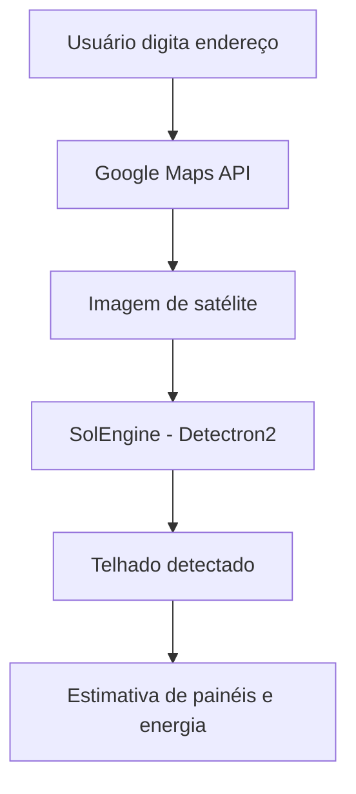

# 🌞 SolEngine — Detecção de Telhados via Satélite para Energia Solar

> Protótipo inteligente para facilitar a pré-venda de sistemas fotovoltaicos.

## 📌 Sobre o Projeto

O **SolEngine** é um sistema baseado em Machine Learning que automatiza a detecção de telhados em imagens de satélite, com o objetivo de simplificar o processo de orçamentos para instalação de painéis solares. 

A proposta é que o usuário apenas insira o endereço de sua residência, e o sistema:

1. **Capture automaticamente** uma imagem de satélite da localização via API do Google Maps.
2. **Detecte o telhado** da casa na imagem usando um modelo de detecção treinado.
3. **Calcule a área disponível** e estime:
   - Quantos painéis solares cabem no telhado
   - Potencial médio de geração anual (kWh)
   - Economia estimada na conta de luz
   - Custo médio da instalação

Este projeto é um protótipo acadêmico desenvolvido como parte de uma disciplina de aprendizado de máquina.

---

## 🧠 Como Funciona

### 🔍 Entrada
- Endereço fornecido pelo usuário
- Imagem de satélite da residência via Google Maps API

### 🏠 Detecção
- Modelo de Machine Learning treinado com imagens rotuladas de telhados
- Arquitetura: **Detectron2**

### 📏 Cálculo
- A área do telhado é estimada a partir da segmentação da imagem
- O sistema utiliza a geolocalização para calcular:
  - Insolação média da região
  - Capacidade de geração por painel (ex: 400W)
  - Espaço mínimo por painel

---

## 💻 Arquitetura do Sistema

---

## 📊 Precisão do Modelo

- **Arquitetura:** Detectron2
- **Dataset:** 
  - 500 imagens anotadas para treinamento
  - 200 imagens para testes
- **Resultados:**
  - **mAP (mean Average Precision):** 0.87
  - **Precisão média em testes reais:** 92%

---

## 📸 Exemplo de Funcionamento

Imagem de entrada (satélite) → Resultado da detecção do modelo:

  
  

---

## 🧪 Notebooks

- `Projeto_6_ML_Model.ipynb` — Treinamento do modelo
- `Projeto_6_Satellite_Images.ipynb` — Coleta e pré-processamento das imagens
- `testing_model.ipynb` — Testes do modelo em novos endereços

---

## 👨‍💻 Autor

**Tibério Cerqueira**  
Graduando em Ciência da Computação — CESAR School
